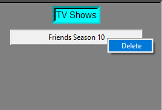
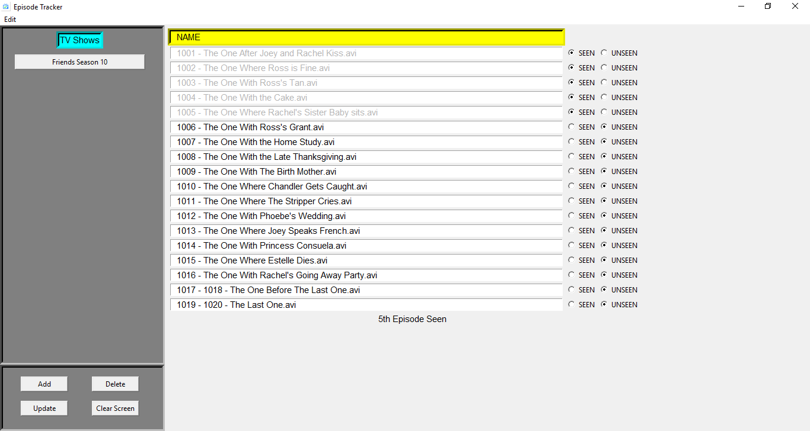

# Episode Tracker
A simple GUI application to keep track of seen and unseen episodes of TV shows.

## Installation
1. Make sure python 3.6 is installed on your system.
2. Clone the repository.
3. Install all the packages in ```requirements.txt```.  
 To install using pip on command line, run ```pip install -r requirements.txt```.
4. Run ```Episode Tracker.py```,  
 ```
 python "Episode Tracker.py"
 ```
5. [Optional] To build the .exe file, run  
 ```
 python setup.py bdist
 ```  
 Check ```<project-location>\build\exe.win-amd64-3.6\Episode Tracker.exe```.  
 and   
 Check ```<project-location>\dist\Episode Tracker-1.1.win-amd64.zip```.

## Usage
Windows users can download the zip from [release](https://github.com/mohitbansal964/Episode-Tracker/releases).  
Extract the zip and open ```Episode Tracker.exe```.

After that Episode Tracker application should appear:
  

## Add a new show  
1. Click on Add Button or Right Click in Sidebar > Add or Click on Edit in Menu Bar > Add.
2. Fill in the details.
	* Enter Show Name: Friends
	* Enter Season Number: 10
	* Enter Directory Path: Absolute Path to Directory
3. Press Enter or Click on Submit.
<p align="center">
  
</p>

A new button in the sidebar will be created like this: 
<p align="center">
  
</p>

## Update a show
1. Click on Update Button or Right Click in Sidebar > Update or Click on Edit in Menu Bar > Update.
2. Fill in the details.
	* Enter Show Name: Friends Season 10 (This must match with an existing button in the sidebar.)
	* Enter Directory Path: Absolute Path to Directory
3. Click on Submit.
<p align="center">
  
</p>

List of the episodes will be updated.

## Delete a show

Right Click on show button and Click Delete.
<p align="center">
  
OR
</p>
1. Click on Delete Button or Right Click in Sidebar > Delete or Click on Edit in Menu Bar > Delete.  
2. Fill in the details.
	* Enter Show Name: Friends Season 10 (This must match with an existing button in the sidebar.)  
3. Click on Submit.
<p align="center">
  
</p>


## Clear Screen
To clear the main screen, Click on Clear Screen Button.

## Mark Seen or Unseen an episode.
1. Click on show button from sidebar. List of episodes will appear in the main area.
2. Click on Seen radiobutton to mark an episode seen.


## License
The content of this repository is licensed under [MIT LICENSE](LICENSE.txt).